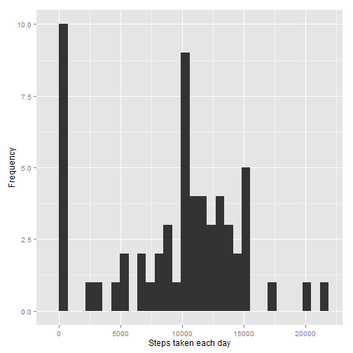
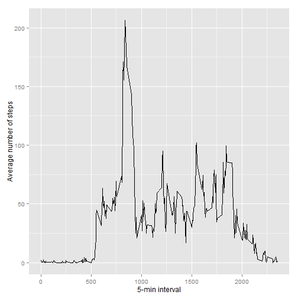
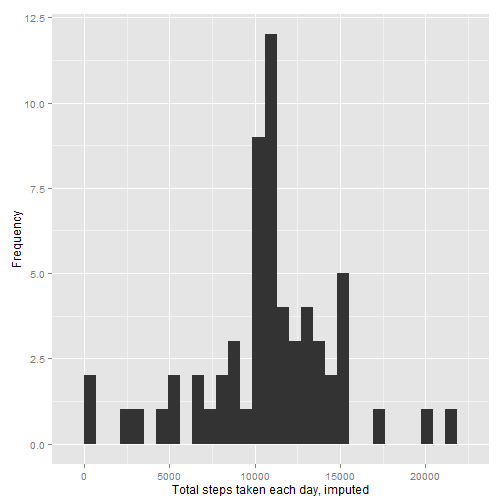
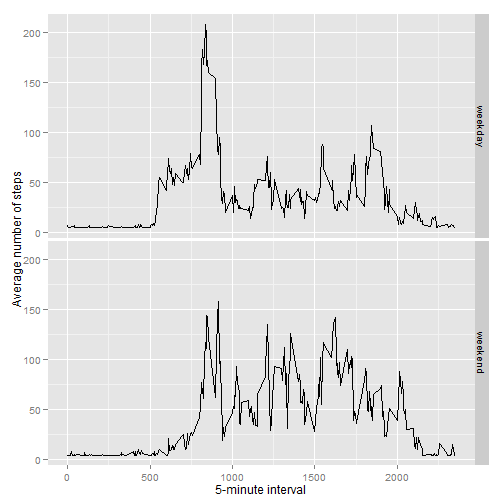

## Loading and preprocessing the data
1 - Load the data


```r
if(!file.exists('activity.csv')){
    unzip('activity.zip')
}
activityDataCsv <- read.csv('activity.csv')
str(activityDataCsv)
```

```
## 'data.frame':	17568 obs. of  3 variables:
##  $ steps   : int  NA NA NA NA NA NA NA NA NA NA ...
##  $ date    : Factor w/ 61 levels "2012-10-01","2012-10-02",..: 1 1 1 1 1 1 1 1 1 1 ...
##  $ interval: int  0 5 10 15 20 25 30 35 40 45 ...
```

2 - Process/transform the data (if necessary) into a format suitable for your analysis


## What is mean total number of steps taken per day?


```r
stepsByDay <- tapply(activityDataCsv$steps, activityDataCsv$date, sum, na.rm=TRUE)
summary(stepsByDay)
```

```
##    Min. 1st Qu.  Median    Mean 3rd Qu.    Max. 
##       0    6780   10400    9350   12800   21200
```

1 - Make a histogram of the total number of steps taken each day


```r
library(ggplot2)
```

```
## Warning: package 'ggplot2' was built under R version 3.0.3
```

```r
qplot(stepsByDay, xlab='Steps taken each day', ylab='Frequency')
```

```
## stat_bin: binwidth defaulted to range/30. Use 'binwidth = x' to adjust this.
```

 

2 - Calculate and report the mean and median total number of steps taken per day


```r
meanStepsByDay <- mean(stepsByDay)
medianStepsByDay <- median(stepsByDay)
print(meanStepsByDay)
```

```
## [1] 9354
```

```r
print(medianStepsByDay)
```

```
## [1] 10395
```
## What is the average daily activity pattern?


```r
averageStepsPerTimeChunk <- aggregate(x=list(meanSteps=activityDataCsv$steps), by=list(interval=activityDataCsv$interval), FUN=mean, na.rm=TRUE)

str(averageStepsPerTimeChunk)
```

```
## 'data.frame':	288 obs. of  2 variables:
##  $ interval : int  0 5 10 15 20 25 30 35 40 45 ...
##  $ meanSteps: num  1.717 0.3396 0.1321 0.1509 0.0755 ...
```

1 - Make a time series plot of the 5-minute interval (x-axis) and the average number
of steps taken, averaged across all days (y-axis)


```r
ggplot(data=averageStepsPerTimeChunk, aes(x=interval, y=meanSteps)) +
    geom_line() +
    xlab("5-min interval") +
    ylab("Average number of steps") 
```

 

2 - Which 5-minute interval, on average across all the days in the dataset, contains the maximum number of steps ?


```r
maxNumberOfSteps <- which.max(averageStepsPerTimeChunk$meanSteps)
timeMaxNumberOfSteps <-  gsub("([0-9]{1,2})([0-9]{2})", "\\1:\\2", averageStepsPerTimeChunk[maxNumberOfSteps,'interval'])

print(maxNumberOfSteps)
```

```
## [1] 104
```

```r
print(timeMaxNumberOfSteps)
```

```
## [1] "8:35"
```


## Imputing missing values

1 - Calculate and report the total number of missing values in the dataset (i.e. the total number of rows with NAs)


```r
numberOfMissingValues <- length(which(is.na(activityDataCsv$steps)))

print(numberOfMissingValues)
```

```
## [1] 2304
```

2 - Devise a strategy for filling in all of the missing values in the dataset.

3 - Create a new dataset that is equal to the original dataset but with the missing data filled in.


```r
library(Hmisc)

activityDataCsvImputed <- activityDataCsv
activityDataCsvImputed$steps <- impute(activityDataCsv$steps, fun=mean)
str(activityDataCsvImputed)
```

```
## 'data.frame':	17568 obs. of  3 variables:
##  $ steps   :Class 'impute'  atomic [1:17568] 37.4 37.4 37.4 37.4 37.4 ...
##   .. ..- attr(*, "imputed")= int [1:2304] 1 2 3 4 5 6 7 8 9 10 ...
##  $ date    : Factor w/ 61 levels "2012-10-01","2012-10-02",..: 1 1 1 1 1 1 1 1 1 1 ...
##  $ interval: int  0 5 10 15 20 25 30 35 40 45 ...
```

4a - Make a histogram of the total number of steps taken each day and ...


```r
totalStepsByDayImputed <- tapply(activityDataCsvImputed$steps, activityDataCsvImputed$date, sum)


qplot(totalStepsByDayImputed, xlab='Total steps taken each day, imputed', ylab='Frequency')
```

```
## stat_bin: binwidth defaulted to range/30. Use 'binwidth = x' to adjust this.
```

 

4b - Calculate and report the mean and median total number of steps taken per day.


```r
meanTotalStepsByDayImputed <- mean(totalStepsByDayImputed)
medianTotalStepsByDayImputed <- median(totalStepsByDayImputed)
print(meanTotalStepsByDayImputed)
```

```
## [1] 10766
```

```r
print(medianTotalStepsByDayImputed)
```

```
## [1] 10766
```

## Are there differences in activity patterns between weekdays and weekends?

1 - Create a new factor variable in the dataset with two levels - "weekday" and "weekend" indicating
whether a given date is a weekday or weekend day.


```r
activityDataCsvImputed$dateType <-  ifelse(as.POSIXlt(activityDataCsvImputed$date)$wday %in% c(0,6), 'weekend', 'weekday')
str(activityDataCsvImputed)
```

```
## 'data.frame':	17568 obs. of  4 variables:
##  $ steps   :Class 'impute'  atomic [1:17568] 37.4 37.4 37.4 37.4 37.4 ...
##   .. ..- attr(*, "imputed")= int [1:2304] 1 2 3 4 5 6 7 8 9 10 ...
##  $ date    : Factor w/ 61 levels "2012-10-01","2012-10-02",..: 1 1 1 1 1 1 1 1 1 1 ...
##  $ interval: int  0 5 10 15 20 25 30 35 40 45 ...
##  $ dateType: chr  "weekday" "weekday" "weekday" "weekday" ...
```

2 - Make a panel plot containing a time series plot


```r
averagedActivityDataCsvImputed <- aggregate(steps ~ interval + dateType, data=activityDataCsvImputed, mean)
str(averagedActivityDataCsvImputed)
```

```
## 'data.frame':	576 obs. of  3 variables:
##  $ interval: int  0 5 10 15 20 25 30 35 40 45 ...
##  $ dateType: chr  "weekday" "weekday" "weekday" "weekday" ...
##  $ steps   : num  7.01 5.38 5.14 5.16 5.07 ...
```

```r
ggplot(averagedActivityDataCsvImputed, aes(interval, steps)) + 
    geom_line() + 
    facet_grid(dateType ~ .) +
    xlab("5-minute interval") + 
    ylab("Average number of steps")
```

 
